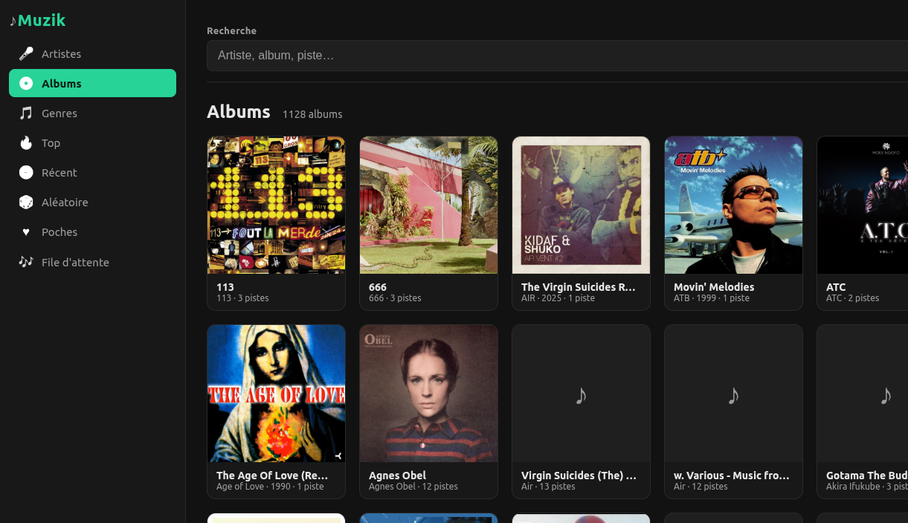
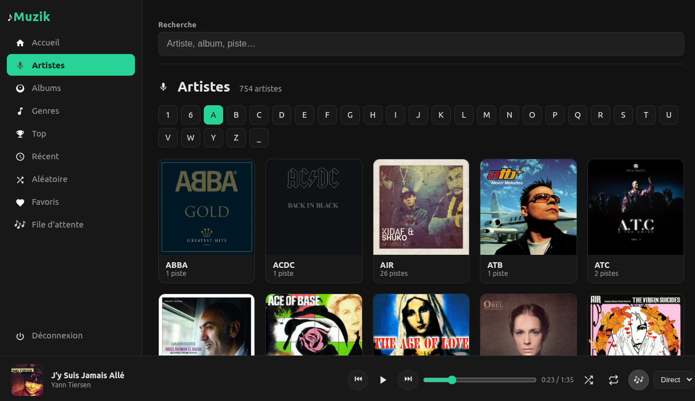
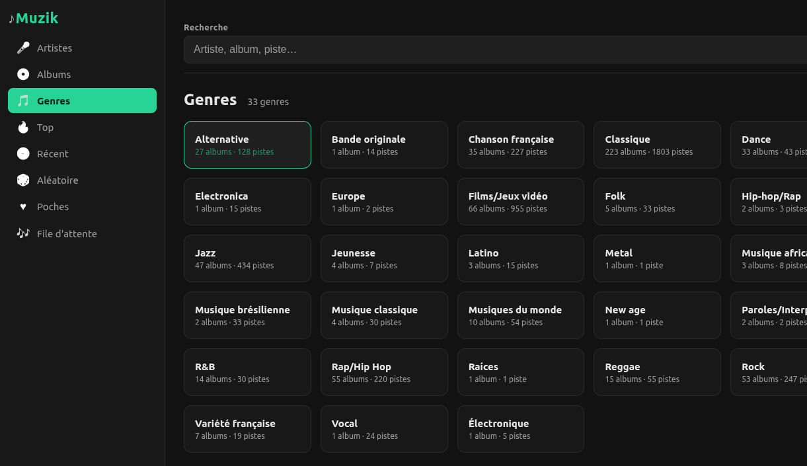
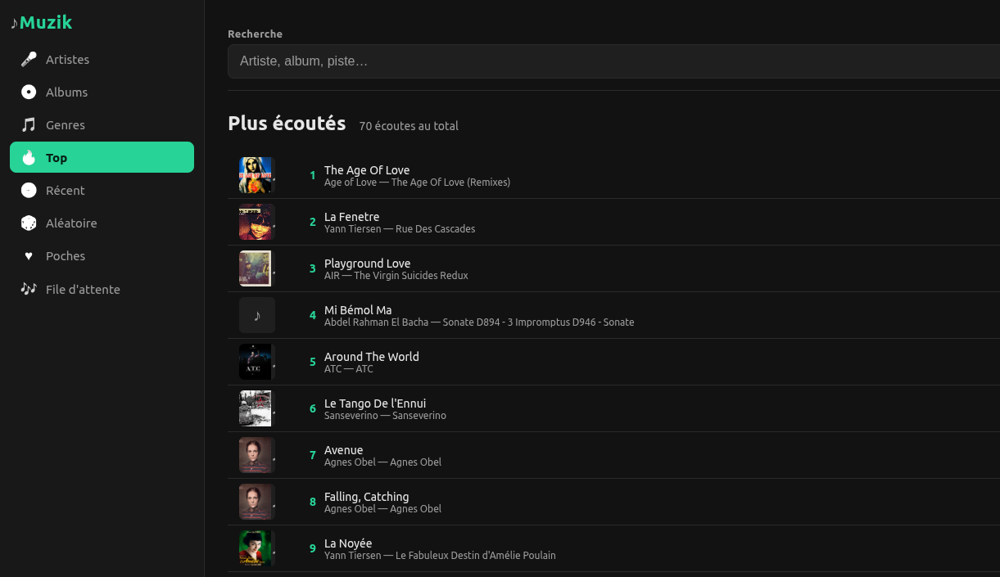
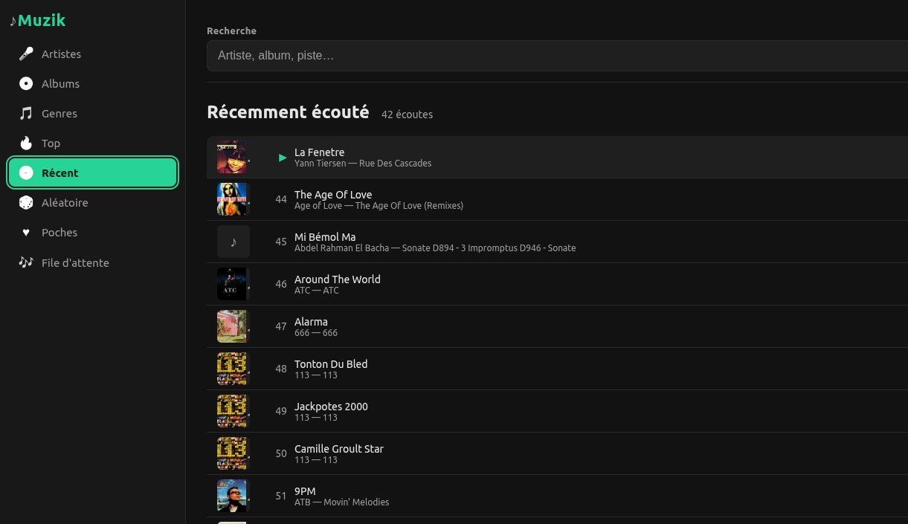
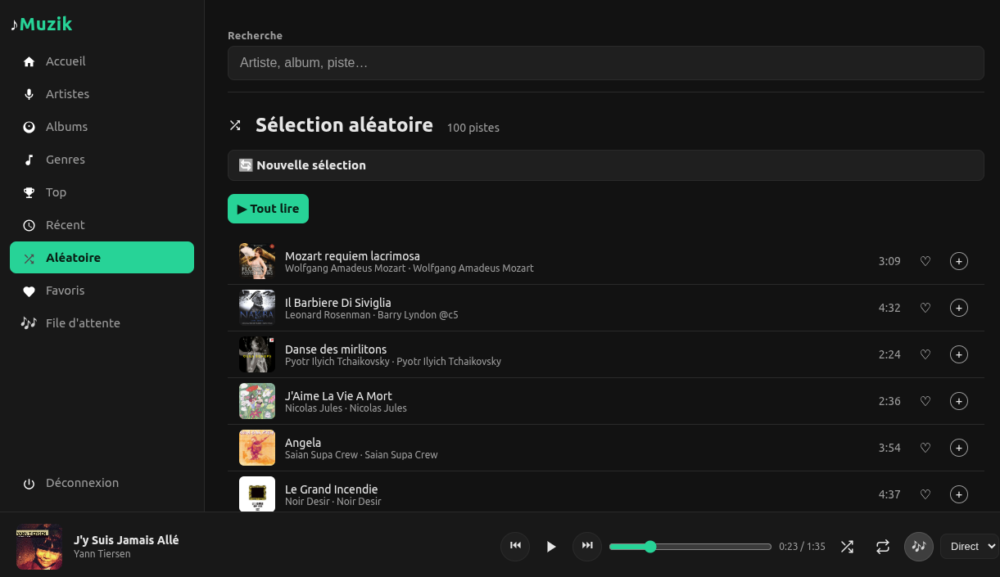

# Muzik

Muzik est un lecteur de musique web auto-hébergé. Il indexe une bibliothèque locale dans SQLite, expose une API PHP et fournit une interface responsive installable comme PWA.

<p align="center">
  <a href="https://github.com/Manu86/muzik/actions"></a>
  <a href="LICENSE"></a>
  
  <a href="https://github.com/Manu86/muzik/releases"></a>
</p>

## Aperçu

<p align="center">
  
</p>

<p align="center">
  <a href="docs/screenshots/muzik-artistes.png">
    
  </a>
  <a href="docs/screenshots/muzik-albums.png">
    
  </a>
  <a href="docs/screenshots/muzik-genres.png">
    
  </a>
  <a href="docs/screenshots/muzik-plus-ecoutes.png">
    
  </a>
  <a href="docs/screenshots/muzik-recemment-ecoute.png">
    
  </a>
  <a href="docs/screenshots/muzik-selection-aleatoire.png">
    
  </a>
</p>

<p align="center">
  <sub>Cliquez sur une capture pour l'afficher en grand.</sub>
</p>

## Fonctionnalités

- navigation par artistes, albums et genres ;
- recherche dans les artistes, albums et titres ;
- lecture directe avec prise en charge des requêtes HTTP `Range` ;
- transcodage MP3 à la volée avec FFmpeg ;
- file d’attente, lecture aléatoire et répétition ;
- favoris ;
- statistiques des pistes et albums les plus écoutés ;
- historique des écoutes récentes ;
- récupération de jaquettes et de genres depuis Deezer, MusicBrainz et iTunes ;
- installation sur mobile ou ordinateur grâce au manifeste PWA.

## Prérequis

- PHP 8.1 ou supérieur ;
- extensions PHP `pdo_sqlite`, `mbstring`, `json` et `fileinfo` ;
- Composer ;
- FFmpeg pour le transcodage ;
- `curl` pour les scripts d’enrichissement ;
- Python 3 et [Mutagen](https://mutagen.readthedocs.io/) uniquement pour écrire les tags audio.

## Installation

Au premier lancement (absence de `config.local.php` et d’installation déjà
marquée), Muzik affiche une page d’installation à `http://…/install.php`.
Elle permet de :

- vérifier les prérequis (PHP, extensions, dépendances `vendor/`, FFmpeg,
  droits d’écriture) ;
- indiquer où se trouvent les fichiers de musique (`music_root`) ;
- régler le chemin FFmpeg et le débit de transcodage ;
- protéger optionnellement l’application par mot de passe (Apache) ;
- écrire `config.local.php` et lancer l’indexation initiale de la bibliothèque.

La procédure manuelle reste possible :

```bash
composer install
cp config.local.example.php config.local.php
# Adapter ensuite config.local.php à la machine
php bin/scan.php
php -S 127.0.0.1:8080 -t public public/index.php
```

L’application est alors accessible sur `http://127.0.0.1:8080`.
Pour réafficher la page d’installation, supprimer `config.local.php` (et, si
besoin, `data/muzik.db`).

La protection par mot de passe est gérée par l'application PHP elle-même,
via des sessions et un hachage bcrypt : il suffit de renseigner `auth_user` et
`auth_hash` dans [config.local.php](config.local.php). Tant que ces deux clés
sont vides, toutes les routes restent ouvertes. La route `POST /api/login`
ouvre une session et `POST /api/logout` la ferme ; chaque route protégée
renvoie `401 {"error":"Unauthorized"}` tant qu'aucune session n'est établie.

Le projet contient aussi une configuration Apache optionnelle pour une
installation sous `/muzik`, **sans** protection HTTP Basic en regard de
celle-ci :

```bash
cp config/apache-muzik.conf.example config/apache-muzik.conf
# Adapter les chemins
sudo bash bin/deploy-apache.sh
```

Le fichier `config/apache-muzik.conf` reste local et est ignoré par Git.
N'exposez pas l'application sur Internet sans HTTPS.

## Configuration

Les valeurs portables se trouvent dans [config/app.php](config/app.php).
[config.php](config.php) les charge puis applique, lorsqu'il existe, le fichier
local `config.local.php` :

```php
return [
    'music_root' => '/path/to/music',
    'db_path' => __DIR__ . '/data/muzik.db',
    'ffmpeg' => '/usr/bin/ffmpeg',
    'transcode' => 0,
    'auth_user' => '',
    'auth_hash' => '',
];
```

| Clé | Rôle |
|---|---|
| `music_root` | Racine absolue de la bibliothèque musicale |
| `db_path` | Chemin de la base SQLite |
| `ffmpeg` | Exécutable FFmpeg utilisé pour le transcodage |
| `transcode` | Débit par défaut en kbit/s, ou `0` pour la lecture directe |
| `auth_user` | Nom d'utilisateur autorisé si la connexion est activée (laisser vide pour désactiver) |
| `auth_hash` | Mot de passe haché en bcrypt (ex. `password_hash($motdepasse, PASSWORD_BCRYPT)`), jamais en clair |


Créez `config.local.php` à partir de `config.local.example.php`. Ce fichier
n'est jamais versionné : les chemins de la bibliothèque et les autres choix
propres à une machine ne sont donc pas publiés.

Le répertoire `data/` est lui aussi ignoré, à l'exception de son fichier
`.gitkeep`. La base SQLite, les journaux, les plans de tags et le catalogue local
ne doivent jamais être ajoutés au dépôt.

## Indexer la bibliothèque

```bash
# Scan incrémental : ajoute et met à jour les fichiers
php bin/scan.php

# Scan complet : supprime aussi de SQLite les entrées dont le fichier a disparu
php bin/scan.php --full
```

Formats reconnus : MP3, FLAC, OGG, M4A et WAV.

Le scanner privilégie les tags audio. Lorsque ceux-ci sont absents ou génériques, il déduit artiste, album, disque, numéro de piste et titre depuis l’arborescence et le nom du fichier.

## Enrichir les métadonnées

### Jaquettes

```bash
php bin/fetch-art.php
php bin/fetch-art.php --limit 10
```

Les sources sont interrogées dans l’ordre suivant : Deezer, MusicBrainz avec Cover Art Archive, puis iTunes. Les images sont enregistrées près des fichiers musicaux sous le nom `cover.jpg` ou `cover.png`.

Dans la vue des artistes, une jaquette de l'album comportant le plus de pistes
est utilisée automatiquement lorsqu'aucune photo d'artiste n'est disponible.

### Images d'artistes

```bash
# Recherche stricte sur Deezer, sans téléchargement ni modification de la base
php bin/fetch-artist-art.php

# Nouvelle tentative des recherches restées sans résultat
php bin/fetch-artist-art.php --force

# Téléchargement des correspondances exactes et mise à jour de SQLite
php bin/fetch-artist-art.php --apply
```

L'outil ne recherche que les artistes qui n'ont ni portrait ni jaquette
d'album utilisable. Les noms génériques comme `Classique`, `Jazz` ou `BO`
sont ignorés afin d'éviter les images sans rapport. La simulation ouvre
SQLite en lecture seule, ce qui la rend compatible avec un dépôt monté par SMB.

### Genres

```bash
# Simulation et génération du plan
php bin/tag.php

# Écriture dans les fichiers audio et dans SQLite
php bin/tag.php --apply
```

### Albums inconnus

```bash
php bin/album-resolve.php
php bin/album-resolve.php --apply
```

### Renommer un album (nom, année)

Sur la page d'un album, le bouton **✏ Modifier** met à jour immédiatement la base
via `PATCH /api/album/{id}`. Pour répercuter le changement dans les tags des
fichiers audio, lancer ensuite :

```bash
# Simulation (plan généré, aucun tag écrit)
php bin/album-edit.php <id>

# Écriture des tags ID3/Vorbis/MP4
php bin/album-edit.php <id> --apply
```

Sans `--apply`, les scripts de tags fonctionnent en mode simulation. Avec `--apply`, ils modifient les tags des fichiers musicaux. Sauvegardez la bibliothèque avant une opération massive.

## Développement et qualité

```bash
composer test      # PHPUnit
composer lint      # syntaxe de tous les fichiers PHP
composer analyse   # PHPStan niveau 10
composer cs-check  # vérifie le format PER-CS 2.0
composer cs-fix    # corrige le format
composer quality   # exécute tous les contrôles précédents
```

Les tests utilisent uniquement des bases et fichiers sous le répertoire temporaire du système. Ils ne doivent jamais accéder à `data/muzik.db` ni à la bibliothèque configurée.

## Publier le dépôt

Les données locales, configurations privées et fichiers d'authentification
sont exclus par `.gitignore`. Vérifiez toutefois toujours la sélection avant un
premier commit :

```bash
git init
# Recommandé lorsque le projet se trouve sur un partage SMB
git config core.fileMode false
git branch -M main
git add .
git status
git diff --cached --summary
```

Les fichiers `config.local.php`, `config/apache-muzik.conf` et
`data/muzik.db` ne doivent jamais apparaître dans la liste. La CI GitHub exécute
la validation Composer et `composer quality` avec PHP 8.1 et PHP 8.4.

## Architecture

```text
public/index.php        point d’entrée HTTP et fichiers statiques
public/assets/app.js    interface et lecteur audio
public/install.php      page d’installation au premier lancement
config.php              charge la configuration publique puis locale
config/app.php          valeurs portables versionnées
config.local.php        valeurs propres à la machine, ignorées par Git
src/Router.php          routage HTTP
src/Api.php             API du catalogue et de la lecture
src/Installer.php       contrôle des prérequis et écriture de la configuration
src/Streamer.php        streaming direct et transcodage
src/DB.php              connexion, schéma et migrations SQLite
src/Scanner.php         indexation de la bibliothèque
bin/                    commandes d’administration
data/                   base, caches, plans et journaux locaux
tests/                  tests PHPUnit
```

Le schéma SQLite contient cinq tables principales : `artists`, `albums`, `songs`, `favorites` et `settings`. Les suppressions d’artistes et d’albums sont propagées par clés étrangères.

## API

L’API est accessible sous `api/` depuis la racine de l’application. Exemples :

```bash
curl http://127.0.0.1:8080/api/summary
curl 'http://127.0.0.1:8080/api/search?q=Massive%20Attack'
curl http://127.0.0.1:8080/api/album/42
curl -H 'Range: bytes=0-1048575' http://127.0.0.1:8080/api/stream/123
```

La description exhaustive et lisible par les outils OpenAPI se trouve dans [openapi.yaml](openapi.yaml).

Points importants :

- `DELETE /api/album/{id}` supprime réellement les pistes et les jaquettes situées sous `music_root` ;
- l’ajout et le retrait des favoris utilisent encore des paramètres sur `GET /api/favorites` ;
- la mise à jour d’un réglage utilise encore `GET /api/settings?set_key=...&value=...` ;
- l’authentification est gérée par PHP : sessions et hachage bcrypt (`auth_user`/`auth_hash`), la protection Apache HTTP Basic n’est plus utilisée ;
- le service worker conserve l’interface hors ligne, mais pas le catalogue ni les morceaux.

## Documentation pour les contributeurs automatisés

Les consignes destinées aux agents de développement sont dans [AGENTS.md](AGENTS.md). Elles précisent les limites de sécurité, les commandes de validation et les conventions propres au dépôt.

Les propositions de modification sont décrites dans
[CONTRIBUTING.md](CONTRIBUTING.md). Les failles doivent être signalées selon
[SECURITY.md](SECURITY.md), sans publier de données personnelles.

## Licence

Muzik est distribué sous licence **MIT** (voir [LICENSE](LICENSE)). Vous pouvez
l'utiliser, le modifier et le redistribuer librement, à condition de conserver
la notice de copyright.
